# 情報リテラシー学習支援システム

## 生成AIと回答履歴を活用し、フィッシングメール・フェイクニュースの危険要素を学ぶWebアプリ

フィッシングメール、偽SMS、フェイクニュース、出典不明のSNS投稿などを題材に、  
文章中に含まれる危険要素を選択しながら学習できる情報リテラシー学習支援Webアプリです。

単に正解・不正解を表示するだけでなく、  
「見抜けた危険要素」「見逃した危険要素」「余計に選んだ要素」を表示し、  
学習者が自分の理解状況を確認できるようにしています。

また、回答履歴をもとに弱点を推定し、  
類似問題や弱点克服問題を推薦することで、  
学習者ごとの復習を支援します。

🌐 **[情報リテラシー学習支援システムを利用する](https://literacysystem-rkjognsbxnqqclwczewefe.streamlit.app/)**

<p align="center">
  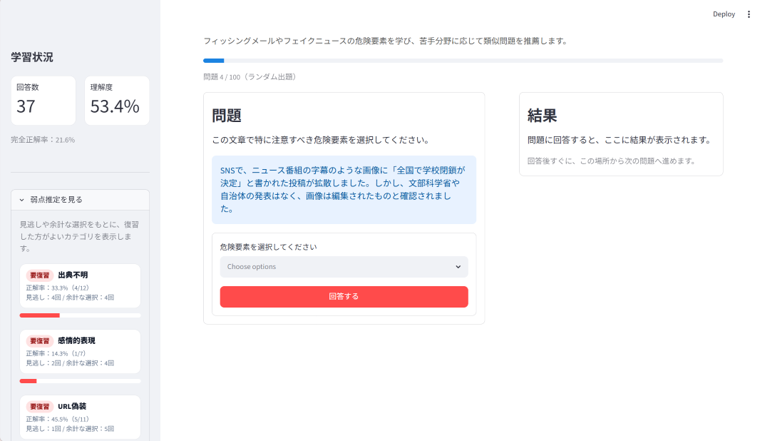
</p>

---

# 制作背景

近年、生成AIの発展により便利なサービスが増える一方で、  
フィッシングメール、偽SMS、フェイクニュースなどの危険性も高まっています。

特に、インターネット上では、

- 実在する企業やサービスを装ったメール
- 緊急性をあおって個人情報を入力させるSMS
- 出典が不明なSNS投稿
- 感情的な表現で拡散を促すフェイクニュース
- AI生成画像や切り抜き画像によるミスリード

など、情報の信頼性を判断する力が必要になる場面が増えています。

しかし、情報リテラシーを体系的に学ぶ機会は必ずしも多くありません。  
そこで本システムでは、実際にありそうなメール文やSNS投稿を読み、  
そこに含まれる危険要素を選択しながら学べるWebアプリを開発しました。

---

# 主な特徴

## 1. 危険要素を選択して学習できる

学習者は、表示されたメール文やSNS投稿を読み、  
その文章に含まれる危険要素を選択します。

1つの文章に複数の危険要素が含まれる場合にも対応できるよう、  
回答形式は複数選択式にしています。

対象とする主な危険要素は以下です。

- 緊急性誘導
- 個人情報要求
- URL偽装
- なりすまし
- 金銭・送金要求
- 添付ファイルの危険性
- フェイクニュース
- 出典不明
- 誇張表現
- 感情的表現
- 画像のミスリード
- 統計の悪用

<p align="center">
  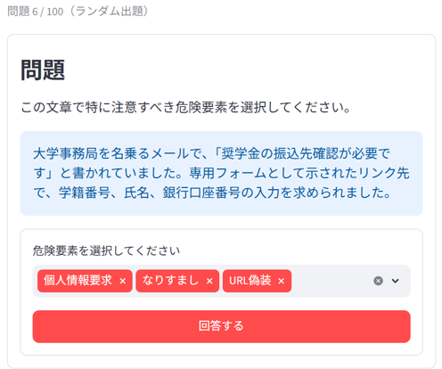
</p>

---

## 2. 完全正解・一部正解・不正解を判定

回答後には、選択したカテゴリと正解カテゴリを比較し、

- 完全正解
- 一部正解
- 不正解

を判定します。

さらに、

- 見抜けた危険要素
- 見逃した危険要素
- 余計に選んだ要素

を分けて表示します。

これにより、単に正解かどうかを見るだけでなく、  
自分がどの危険要素を理解できていて、どこを間違えたのかを確認できます。

<p align="center">
  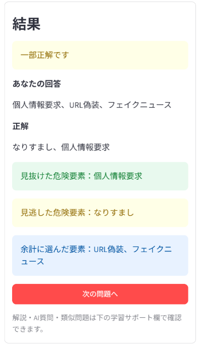
</p>

---

## 3. 根拠と理由を表示

回答後には、正解カテゴリごとに、  
問題文のどこが根拠になるのか、なぜ危険なのかを表示します。

例えば、

- 「24時間以内」
- 「アカウント停止」
- 「氏名・パスワードを入力」

のような表現があれば、  
緊急性誘導や個人情報要求として解説します。

<p align="center">
  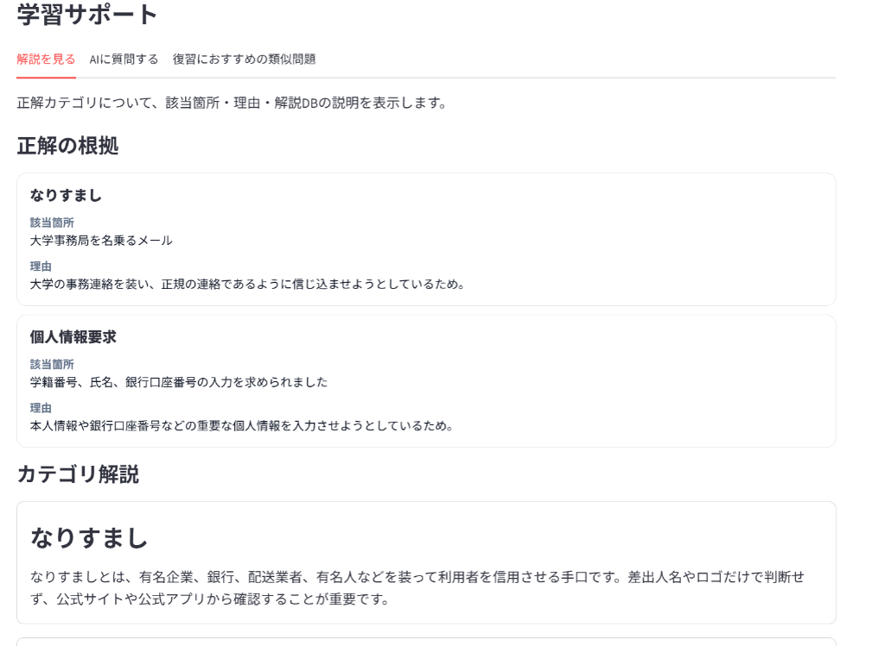
</p>

---

## 4. 回答履歴をもとに弱点を推定

回答履歴をSQLiteに保存し、  
カテゴリごとの正解率、見逃し回数、余計な選択回数を集計します。

これにより、学習者が

- URL偽装を見逃しやすい
- 感情的表現を選びすぎる
- 個人情報要求の判断が苦手

といった具体的な弱点を把握できるようにしています。

<p align="center">
  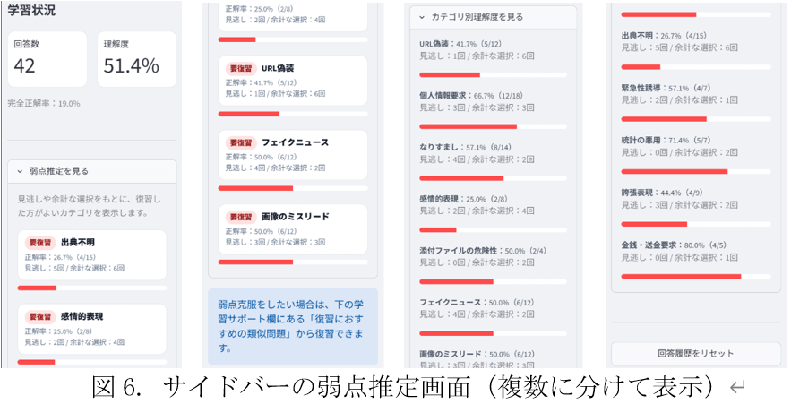
</p>

---

## 5. 類似問題推薦

現在解いている問題と似た問題を推薦します。

問題文をTF-IDFで数値化し、  
コサイン類似度を計算することで、文章の特徴が近い問題を表示します。

これにより、学習者は間違えた問題と似た内容を続けて復習できます。

<p align="center">
  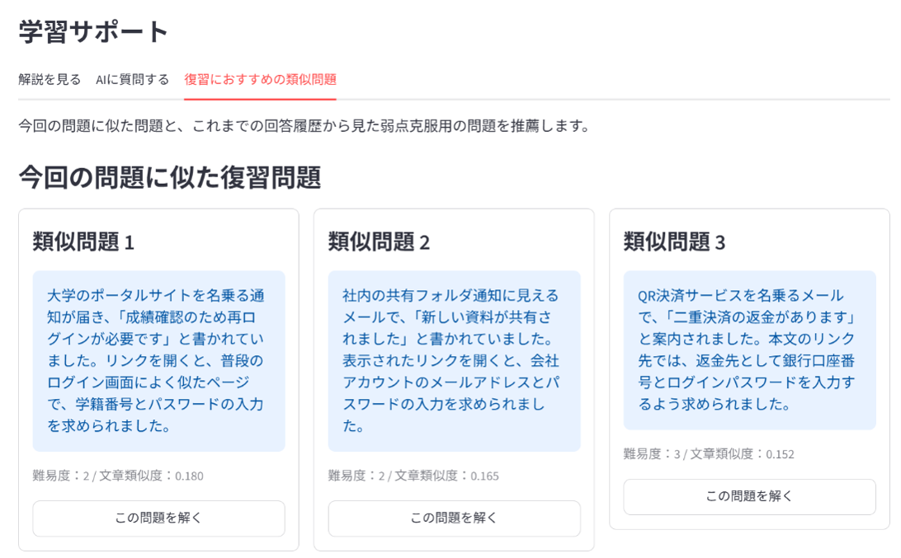
</p>

---

## 6. 弱点克服問題推薦

回答履歴から苦手なカテゴリを推定し、  
そのカテゴリを含む問題を優先的に推薦します。

推薦された問題は、1問ずつ解くことも、  
複数問を順番に解くこともできます。

<p align="center">
  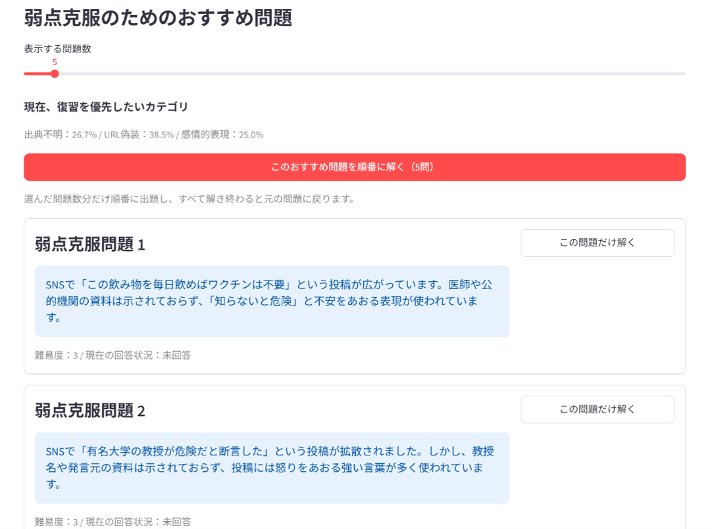
</p>

---

## 7. AI質問機能

解説を読んでも分からない場合に、  
Gemini APIを利用してAIへ追加質問できる機能を実装しています。

ただし、正解判定は生成AIに任せず、  
`problems.json` に保存された正解データに基づいて行っています。

生成AIは、あくまで学習者の疑問に答える補助的な役割として利用しています。

<p align="center">
  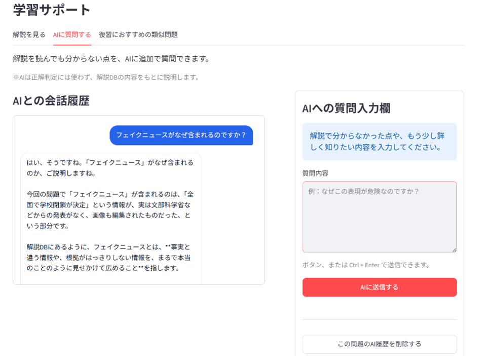
</p>

### 公開版におけるAIチャット機能について

公開版では、Gemini APIキーを設定していない場合、  
AIチャット機能は利用できません。

これは、公開URLから不特定多数の利用者がAI機能を使用することで、  
意図しないAPI利用回数の増加やリソース制限につながる可能性があるためです。

Gemini APIを利用する場合は、Streamlit Community CloudのSecretsに以下を設定してください。

```toml
GEMINI_API_KEY = "自分のGemini APIキー"
```

既存問題の出題、回答判定、解説表示、弱点推定、類似問題推薦は、  
Gemini APIキーがなくても利用できます。

---

# 管理画面アプリ

本システムでは、学習者用アプリとは別に、  
問題データを作成・確認・追加するための管理画面アプリも作成しています。

管理画面アプリでは、WebページのURLを登録し、  
その本文をもとに問題候補を生成できます。

ただし、管理画面では問題データの追加や修正ができるため、  
公開版では学習者用アプリのみをデプロイし、管理画面は公開対象にしていません。

---

## 1. URL登録

問題作成の素材にしたいWebページのURLを登録します。

例として、

- IPA
- フィッシング対策協議会
- 日本ファクトチェックセンター

などのページを登録し、問題生成の素材として利用します。

<p align="center">
  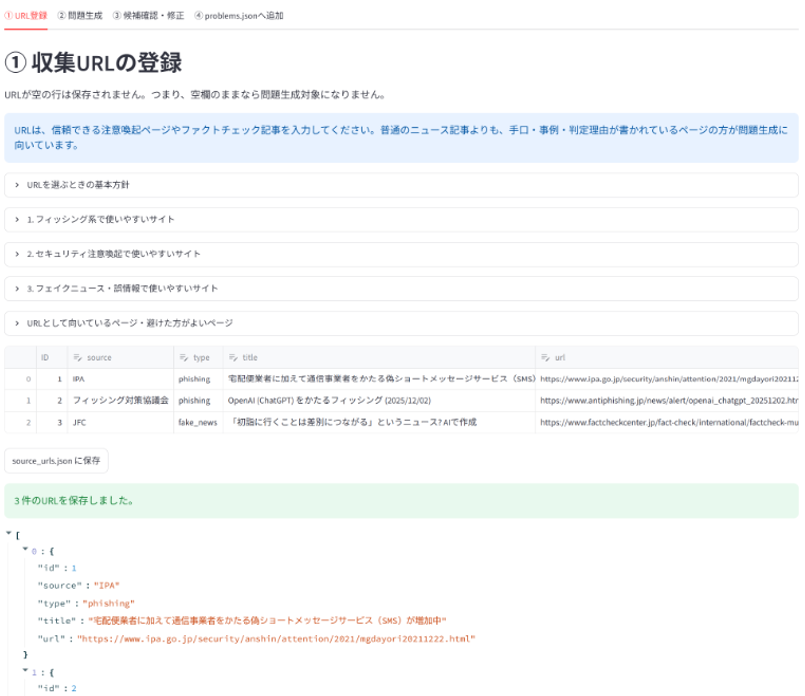
</p>

---

## 2. 問題生成

登録したURLをもとに、以下の処理を実行します。

```text
Webページ取得
      ↓
本文抽出
      ↓
問題素材の分割
      ↓
危険カテゴリ判定
      ↓
問題候補生成
      ↓
Gemini APIによる文章整形
      ↓
候補の自動分類
```

管理者がコマンドラインを直接操作しなくても、  
画面上のボタンから問題候補を生成できるようにしています。

<p align="center">
  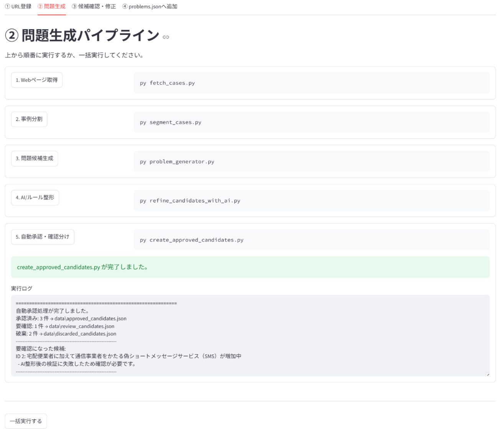
</p>

---

## 3. 候補確認・修正

自動生成された問題候補には、  
問題文が長すぎる、根拠が弱い、カテゴリが不適切などの問題が含まれる可能性があります。

そのため、管理画面で問題候補を確認し、  
必要に応じて問題文、選択肢、正解カテゴリ、根拠、理由を修正できるようにしています。

<p align="center">
  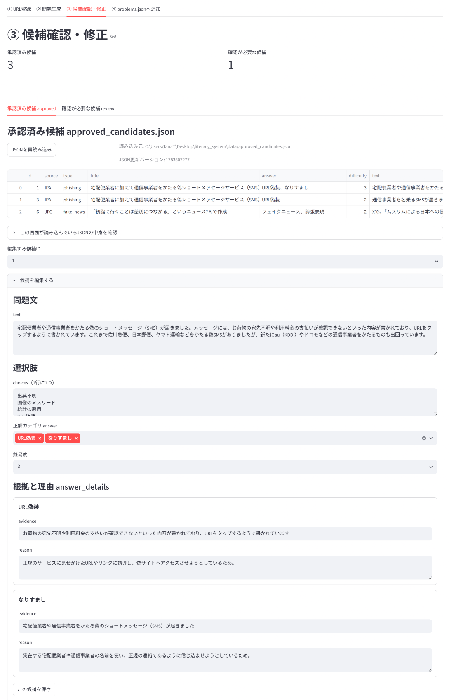
</p>

---

## 4. problems.jsonへ追加

承認済みの問題候補だけを、  
学習者用アプリで使用する `problems.json` へ追加します。

これにより、自動生成された不完全な問題が  
そのまま学習者に出題されることを防いでいます。

<p align="center">
  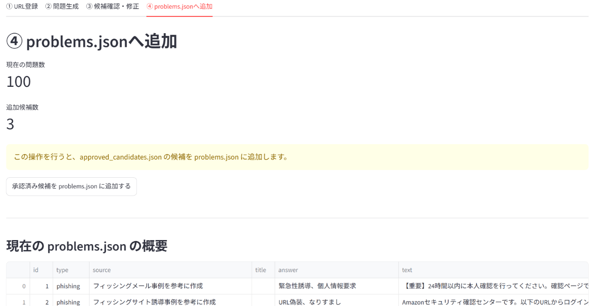
</p>

---

# システム構成

本システムは、以下の要素で構成されています。

- 学習者用アプリ：`app.py`
- 管理画面アプリ：`admin_app.py`
- 問題生成パイプライン
- 問題データ・解説データ
- 回答履歴データベース
- Gemini API
- Streamlit Community Cloud

<p align="center">
  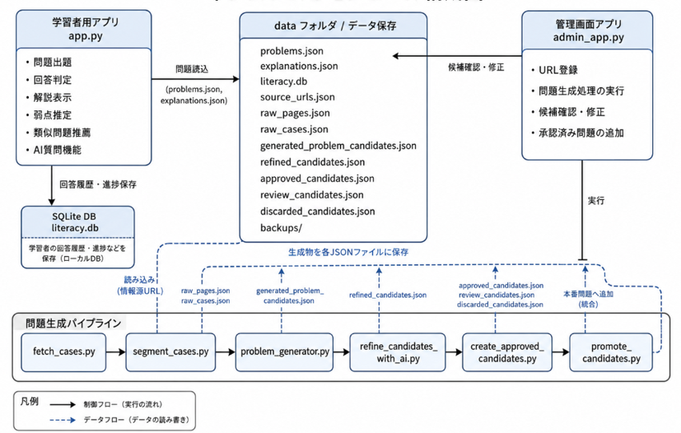
</p>

---

# 主な機能

## 学習者用アプリ

- 問題出題
- 複数選択式の回答
- 完全正解・一部正解・不正解の判定
- 見抜けた危険要素の表示
- 見逃した危険要素の表示
- 余計に選んだ要素の表示
- 正解カテゴリごとの根拠・理由の表示
- 学習状況表示
- 弱点推定
- 類似問題推薦
- 弱点克服問題推薦
- AI質問機能

## 管理画面アプリ

- URL登録
- Webページ取得
- 本文抽出
- 問題素材の分割
- 危険カテゴリ判定
- 問題候補生成
- Gemini APIによる問題文・根拠・理由の整形
- 候補確認・修正
- 承認済み候補の `problems.json` への追加

---

# 使用技術

| 分野 | 使用技術 |
|---|---|
| 言語 | Python |
| Webアプリ | Streamlit |
| データ保存 | JSON |
| データベース | SQLite |
| AI | Google Gemini API |
| 文章類似度 | TF-IDF / コサイン類似度 |
| 機械学習ライブラリ | scikit-learn |
| Webページ取得 | requests |
| HTML解析 | BeautifulSoup |
| 日本語解析 | SudachiPy |
| デプロイ | Streamlit Community Cloud |
| バージョン管理 | Git / GitHub |

---

# 主なデータ

| ファイル | 内容 |
|---|---|
| `data/problems.json` | 学習者用アプリで出題する本番問題データ |
| `data/explanations.json` | 危険カテゴリごとの解説データ |
| `data/category_rules.json` | 危険カテゴリ判定に利用するルール |
| `data/source_urls.json` | 問題生成に利用するURL一覧 |
| `data/approved_candidates.json` | 承認済み問題候補 |
| `data/review_candidates.json` | 要確認の問題候補 |
| `data/discarded_candidates.json` | 破棄された問題候補 |

公開リポジトリには、APIキーや回答履歴データベースは含めていません。

---

# 工夫・改善した点

## 1. 正解判定を生成AIに任せない設計

生成AIは自然な説明文を作ることは得意ですが、  
回答が毎回完全に同じになるとは限りません。

そのため、本システムでは正解判定をGemini APIに任せず、  
`problems.json` に保存した正解カテゴリをもとに判定しています。

AIは、学習者への補足説明や問題候補の文章整形に限定して利用しています。

---

## 2. 完全正解だけでなく一部正解も扱う

情報リテラシーの問題では、  
1つの文章に複数の危険要素が含まれることがあります。

そこで、完全一致だけでなく、  
一部の危険要素を見抜けた場合は一部正解として扱うようにしました。

これにより、学習者は自分が理解できた部分と見逃した部分を分けて確認できます。

---

## 3. 見逃しと余計な選択を弱点として扱う

単純な正解率だけでは、  
具体的にどのカテゴリが苦手なのか分かりにくい場合があります。

そこで、正解カテゴリを選ばなかった「見逃し」と、  
正解ではないカテゴリを選んだ「余計な選択」を記録し、弱点推定に利用しました。

---

## 4. 類似問題推薦による復習支援

問題文をTF-IDFでベクトル化し、  
コサイン類似度を用いて似た問題を推薦しています。

これにより、学習者は間違えた問題と似た問題を続けて学習でき、  
苦手分野の復習につなげられます。

---

## 5. 管理画面による品質管理

URLから自動生成した問題候補をそのまま出題すると、  
根拠が弱い問題やカテゴリが不適切な問題が混ざる可能性があります。

そのため、学習者用アプリと管理画面アプリを分け、  
管理者が確認・修正してから本番問題に追加する仕組みにしました。

---

## 6. APIキーなどの機密情報をGitHubに載せない

Gemini APIキーは、GitHubには公開していません。

ローカル環境では `.streamlit/secrets.toml`、  
Streamlit Community CloudではSecrets管理を用いて設定します。

公開リポジトリには、代わりに以下のサンプルファイルを配置しています。

```text
.streamlit/secrets.example.toml
```

---

## 7. 公開版では学習者用アプリのみを公開

管理画面アプリでは、問題候補の生成、修正、追加ができます。  
そのため、誰でも使える状態で公開すると、問題データが意図せず変更される可能性があります。

そこで、公開版では `app.py` のみをStreamlit Community Cloudにデプロイし、  
学習者用アプリだけをURLから利用できるようにしています。

---

# 実験・動作確認

学習者用アプリでは、以下の機能が正しく動作することを確認しました。

- 問題出題
- 回答判定
- 解説表示
- AI質問
- 学習状況表示
- 弱点推定
- 類似問題推薦
- 弱点克服問題推薦

管理画面アプリでは、以下の流れを確認しました。

- URL登録
- Webページ取得
- 問題素材抽出
- 問題候補生成
- AI整形
- 候補確認・修正
- `problems.json` への追加

また、管理画面アプリによる問題候補生成では、  
30件のURLから38件の問題候補を生成しました。

| 評価項目 | 結果 |
|---|---|
| 登録したURL数 | 30件 |
| 生成された問題候補数 | 38件 |
| URLあたりの平均候補数 | 1.27件 |
| URL数に対する候補生成率 | 126.7％ |
| 承認済み候補 | 20件 |
| 要確認候補 | 14件 |
| 破棄候補 | 4件 |

---

# 実行方法

## 1. ライブラリのインストール

```bash
py -m pip install -r requirements.txt
```

## 2. 学習者用アプリの起動

```bash
py -m streamlit run app.py
```

## 3. 管理画面アプリの起動

```bash
py -m streamlit run admin_app.py
```

---

# requirements.txt

主に以下のライブラリを使用しています。

```text
streamlit==1.58.0
google-genai==2.10.0
scikit-learn==1.9.0
requests==2.34.2
beautifulsoup4==4.15.0
SudachiPy==0.6.11
SudachiDict-core
```

---

# 公開URL

🌐 **[情報リテラシー学習支援システム](https://literacysystem-rkjognsbxnqqclwczewefe.streamlit.app/)**

---

# ソースコードについて

本リポジトリでは、学習者用アプリ、管理画面アプリ、問題生成パイプラインのソースコードを公開しています。

ただし、以下のファイルは公開していません。

- `.streamlit/secrets.toml`
- `data/literacy.db`
- `data/backups/`
- `data/raw_pages.json`
- `data/raw_cases.json`

APIキー、回答履歴、Webページ本文データなどを公開しないようにするためです。

---

# 今後の展望

今後は、以下の改善を行いたいです。

- 画像付き問題への対応
- SNS投稿画像やAI生成画像を見て判断する問題の追加
- 学習者ごとのログイン機能
- 理解度のグラフ表示
- 問題候補生成の精度向上
- API制限時の代替処理

---

# 制作を通して学んだこと

今回の制作では、Webアプリを作るだけでなく、  
問題データの設計、回答履歴の保存、推薦機能、AI連携、管理画面による品質管理など、  
多くの要素を組み合わせる難しさを学びました。

特に、生成AIを利用する場合でも、  
すべてをAIに任せるのではなく、AIが得意な部分と人間が確認すべき部分を分けることが重要だと感じました。

本システムでは、AIを補足説明や文章整形に活用し、  
正解判定や本番問題への追加は、正解データや管理画面で安定して扱う設計にしました。

今後も、AIの便利さだけでなく、  
信頼性や安全性を意識しながら、学習者にとって分かりやすく役立つシステムに改善していきたいです。